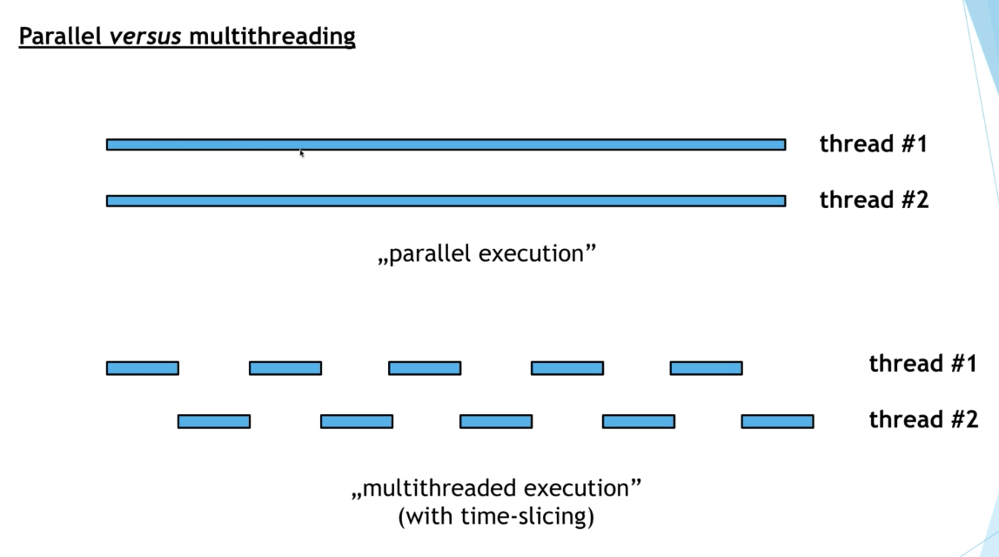

# Multi-threading

## Motivation

1. Programs are sequentially excuted. Time-consuming operations may freeze the application and the users may not know what's happening.
2. Separate multiple tasks which is time critical and might be subject to interference by other tasks.


## Definitions

1. **Process**: an instance of program execution. Each process has its own **register (寄存器)**, **program counter (程序计数器)**, **stack memory** and **heap memory**. A process can have several threads.
    * In Java, we create processes with the help of **ProcessBuilder** class

2. **Thread**: a light-weight process. It is a unit of execution within a given process. Each thread in the process shares the memoyr and resources of the belonging process such as register, stack memory etc metioned above.

3. **Time-slicing**: Processing time for a single core is shared among processes and threads.

    * Example: 

```
thread #1  ---   ---   ---   ---  --Done

thread #2     ---   ---   ---   --Done
```

4. **Parallel Computing**: Every single processor core has just a single thread so that the thread can run continously. So there is no time-slicing in Parallel Computing.




## Pros and Cons

Pros:

1. design responsive applications; do several operations concurrently
2. achieve better resource utilization
3. improve performance with multiple cores and parallel computing

Cons:

1. costs in multithreading
2. deal with synchronization sinces threads share the same memory in process
3. easy to make bugs, hard to detect bugs
4. expensive operations (for example, switching between threads)

**Rule of Thumb**: For small problems, it is unnecessary to use multi-threading. For medium and large problems, the curve of running time and number of threads is like an elbow curve.


## Thread States

1. `NEW`: a thread is in NEW state until run `start()` method

2. `RUNNABLE`: after a thread is started, the thread is executing the task and it is in RUNNABLE state

3. `WAITING`: when a thread is waiting, it is in WAITING state. We can call `wait()` or `sleep()` methods to put a thread into this state. After other thread signals, the WAITING thread goes back to RUNNABLE state

4. `DEAD`: after a thread finishes its task

States:

```
    NEW state  ---(call `start()`)--->  RUNNABLE state ---(finish its task)--->  DEAD state
                                            ↑  ↓
                   (other thread's signal)  ↑  ↓  (call `wait()` or `sleep()`)
                                            ↑  ↓
                                        WAITING state
```


## Construct Thread

### Way 1: Implement Runnable interface

see *Example2_implement_Runnable.java*

### Way 2: Anonymous Runnable

see *Example2_anonymous_Runnable.java*

### Way 3: Extends Thread class

see *Example2_extends_Thread.java*

Usually Way 1 and Way 2 are preferred. Because:

    * Reason 1: The class which extends Thread cannot extends other class
    * Reason 2: Interfaces allows multi-inheritance
    * Reason 3: Implement Runnable does no harm in the software logic


## Daemon Threads and Worker Threads

When we start a program, a main thread is started at the beginning. We can create child threads from the main thread. The main thread is the last thread to finish execution.

### Daemon Threads

Daemon threads are intended as helper threads. They are low-priority threads that runs in background to perform tasks such as garbage collection.

Usually daemon threads for **I/O operations or services**.

Daemon threads are terminated by the **JVM** when **all other worker threads are terminated**.

We need to use `setDaemon(true)` to set a worker thread to be daemon thread.


### Worker Threads

Worker threads are not terminated while daemon threads are interrupted by the JVM.

When we create a thread, it is a worker thread by default.


## Examples

Example 1: incrementor

Example 2: 3 ways to instantiate a thread

Example 3: join method

Example 4: Daemon Threads and Worker Threads


# References

1. [Interface Runnable](https://docs.oracle.com/javase/7/docs/api/java/lang/Runnable.html)

2. [Class Thread](https://docs.oracle.com/javase/7/docs/api/java/lang/Thread.html)

