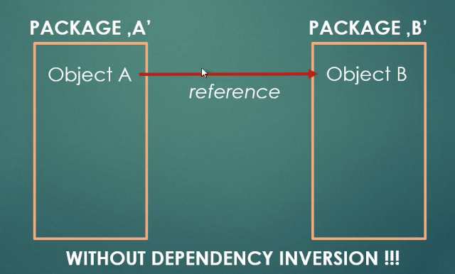
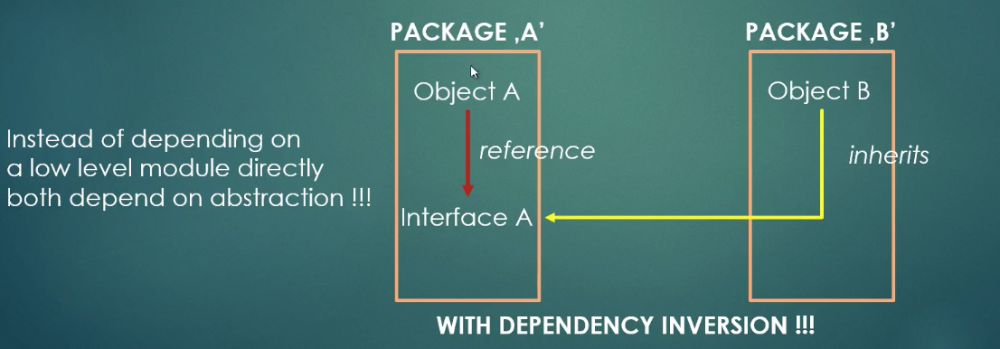

# (D) Dependency Inversion Principle

## Motivation

High level modules rely on low level modules. If low level modules have been changed, such as XML Parser -> PDF Parser, the high level module (the application) has to be changed. 


## Definition

High-level modules should not depend on low-level modules. **Both should depend on abstractions**.

Abstraction should not depend on details. Details (concrete implementation) should depend on abstractions.


## Implementation

Add an abstract layer between Application (high level modules) and Low-level modules.

Example: 

(Bad) 

```java
Dog dog = new Dog();
```

(Good, because of dynamic binding)

```java
Animal dog = new Dog();
```


1. Avoid tightly coupled dependency

```java
public class Person {
    private Address address;

    public Person() {
        address = new Address();    // tightly coupled dependency
    }
}
```

2. Create loosely coupled software modules.

3. Modules should depend on abstraction.

| Wrong | Correct |
| ----- | ------- |
| Object A depends on Object B | Object A and B depend on abstraction (Interface A) |
|  |  |


## How to achieve dependency inversion

1. Use design patterns: factory pattern, template pattern, strategy pattern.

2. Use service locator pattern.

3. Use dependency injection.

