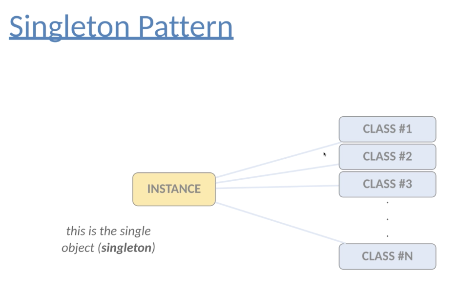

# Creational Pattern 1: Singleton Pattern

## Motivation

It ensures that a class has only 1 instance while providing a **global access point** to this instance.

## Pros and Cons

Pros: 

1. All other classes can request through the global access point of the instance of the singleton class.

Cons: 

1. Difficult to deal with multi-threads or multi-processes.

## When to use

Singleton pattern should be used when we want to control access to **a shared resource** such as files, **databases** or **thread pools**. It is usually used in **logging**.

## Example

1. Version 1: Eager Version

instantiate the singleton instance no matter what it is necessary

2. Version 2: Lazy Version without synchronization

it fails for multi-threads and returns different instances.

3. Version 3: Lazy Version with synchronization

it solves the multi-thread problem, but it is slow and doesn't solve "reflection attack" (with the help of reflection API, new instances can be instantiated despite of private constructor)

4. Version 4: Enum Version

Enum is better solution because enums are compile-time constants, so INSTANCE is thread-safe by default.

