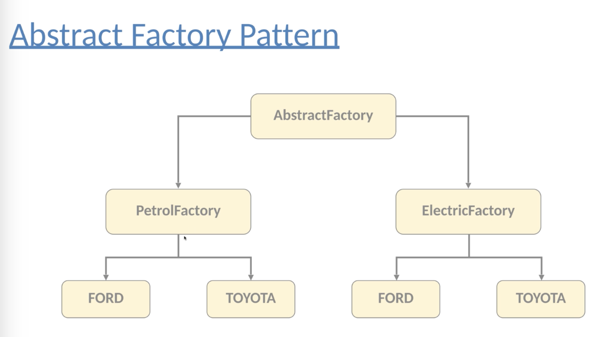

# Creational Pattern 2-1: Factory Pattern

## Motivation

Factory pattern helps to create loosely coupled OOP design.

We should favor abstraction/supertypes (interfaces or abstract classes) instead of concreate implementation. 

Whenever we use `new` keyword, we violate our favor. Tying the code to concreate classes makes less flexible and more fragile.


## Example

(Bad)

```java
Animal dog = new Dog();
```

This is bad because if `Dog` class may change in the future (for example, we remove the default constructor), then we have to change the line. Then the `new` keyword is the problem because `new` instantiates a given class and it is dealing with a concrete class, i.e. a concrete implementation.

(Good)

```java
Animal dog = AnimalFactory.getDog();
```

This is good because if `Dog` class is changed in the future, we can change `AnimalFactory` inside, and there is no need to change this line.

We should encapsulate object creation. Then, we can instantiate the classes in the separate class, i.e. factory class.


## Pros and Cons

Pros:

1. make the code more reusable and robost

Cons:

1. high cyclomatic complexity in factory method (multiple if-else)


## Example

Factory usually have a public static method that is going to return an interface that every concrete class implements.


# Creational Pattern 2-2: Abstract Factory Pattern

Abstract Factory Pattern is designed for creating factories of the factories.


