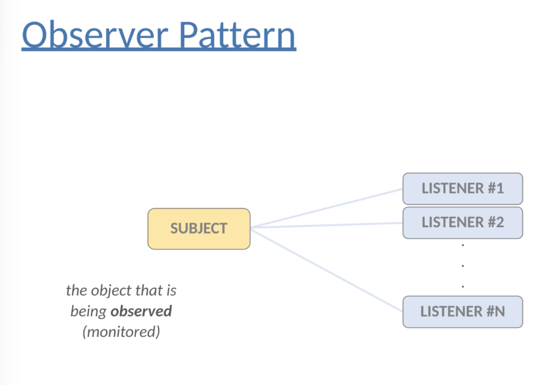

# Behavioral Design Pattern 2: Observer Pattern

## Motivation

Observer Pattern achieves **loosely coupled** principle. Observer Pattern is used very often in user interface components, Android OS applications, swing framework.

## Definition

Observer Pattern defines a **one-to-many** dependency between given objects or entities so that when one object changes states, all of its dependents are **notified and updated** automatically.

**Subject** is the object that is being monitored;

**Observers/Listeners** are depending on the subject.

How to connect Subject and Observers ?

The only way that make the subject knows about an observer is to make the Subject implement the certain interface called **Observer**.

## Examples

Example 1: Subject-Observer weather station

Example 2: Observer Pattern in swing framework

Example 3: Stock Price simulator & Buy or Sell the stock

## Pros and Cons

Pros:

1. do not have to modify the subject to add new type of observers
2. independently reuse subjects or observers
3. can change the subject or observer independently
4. loosely coupled design -- add flexibility

