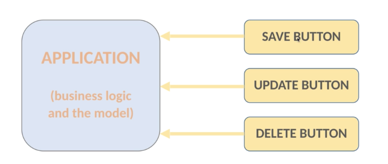
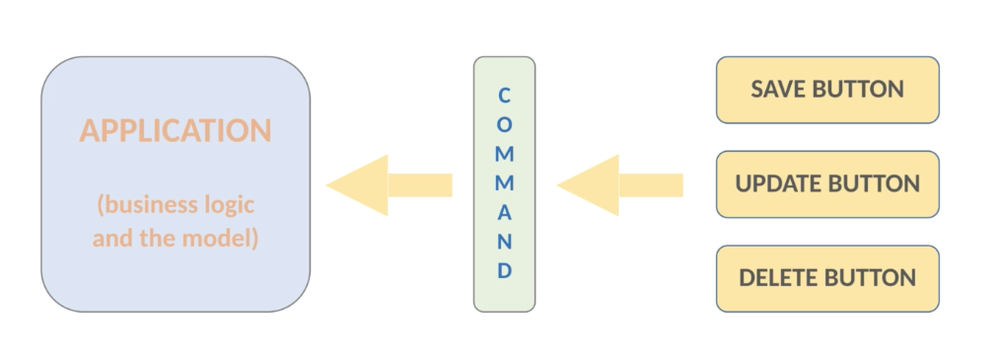

# Behavioral Design Pattern 3: Command Pattern

## Motivation

The aim is to achieve **separation of concerns**. 

## Definition

| Without Command | Command Pattern |
| --------------- | --------------- |
|  |  |
| Application knows everything about 3 given operations and vice versa | Command is an abstract layer dealing with design principle. Command encapsulates the 3 given operations and delegate the operations to the application |

The aim of Command Pattern is to **encapsulate method invocations**, the result is that the method invoking the computations knows nothing about the implementation. (loosely coupled software design)

There are 4 components of the Command Pattern:

1. Command
2. Receiver
3. Invoker
4. Client

## Examples

1. Example 1: Commands to turn on and turn off light

2. Example 2: Producer-Consumer example (similar in Operating System)

## Pros and Cons

Pros:

1. With Command abstract layer, it achieves loosely coupled design.
2. We can change sender's behavior at run-time
3. the user interface (buttons) know nothing about the underlying logic.
4. decouple classes that invoke the operations and decouple classes that will execute these operations (结果同1) ———— Single Responsibility Principle
5. add further commands without modifying existing code ———— Open-closed Principle
6. We can store these commands in a data structure and execute them whenever we want later ———— Implement Undo & Redo Operations

