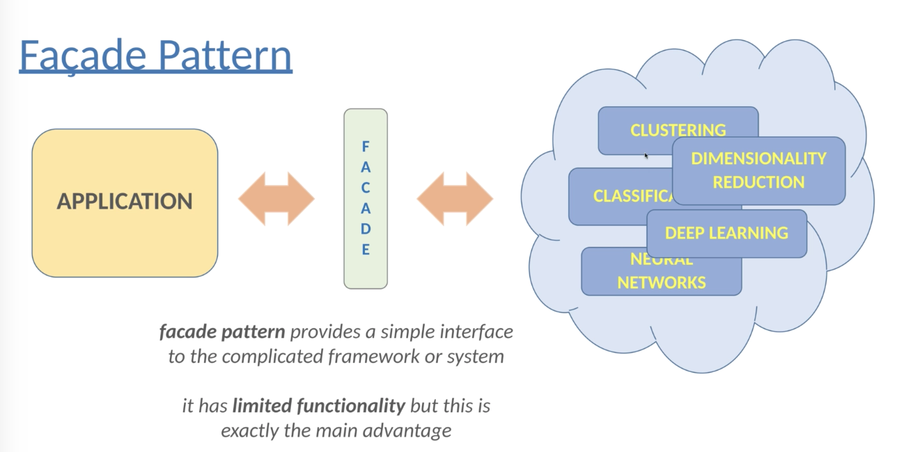

# Structural Design Pattern 2: Façade Pattern

## Motivation

Façade Pattern deals with a complicated library or framework. Modern applications relies on more external libraries, frameworks and APIs. It results the problem that **classes become tightly coupled to the implementation of the frameworks or libraries.

## Definition

Façade Pattern provides a relatively easy-to-understand interface to a rather complex system. It provides limited functionality which the clients actually need.

## Examples

Example 1: 3 sorting algorithms

## Pros and Cons

