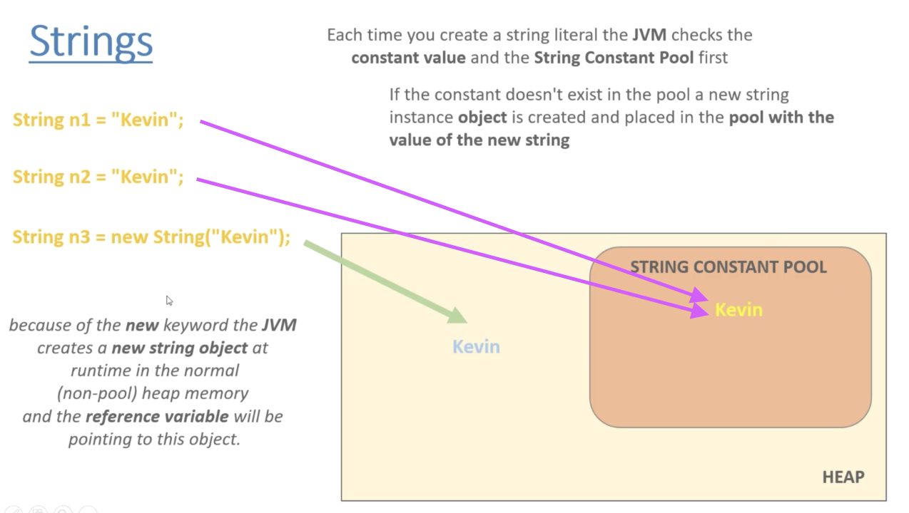
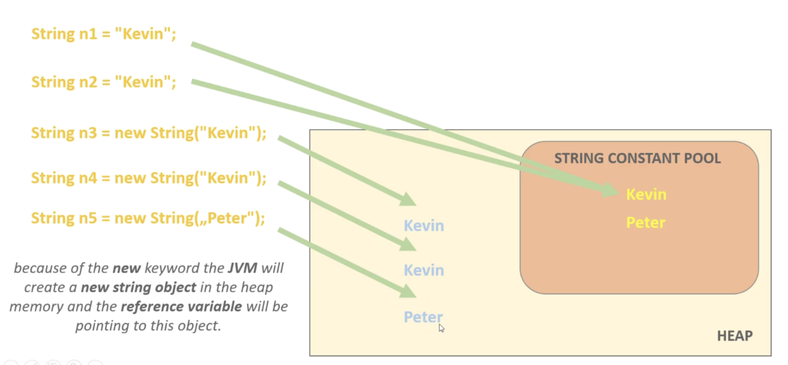

# Structural Design Pattern 3: Flyweight Pattern

## Motivation

We would like to **minimize memory usage** by sharing as much data as possible with similar objects.

Flyweight Pattern is used frequently in game development and Java Virtual Machine.


## Definition

A Flyweight is an object that **minimizes memory usage** by sharing as much data as possible with other similar objects, such as bullets in games, font metrics in word documents etc.

* Instrinsic state

intrinsic states are the same (constant), such as texture of bullets in games, width and height of bullets.

* Extrinsic state

Extrinsic states are unique, such as speed of bullets, position of bullets.


Objects storing the intrinsic states **exclusively** are called **flyweights**. Extrinsic states are stored in a data structure.


## Examples

Example 1: Creating different colors of rectangles

Example 2: How JVM handles Strings

    * In Java, Strings are sequences of characters and they are objects.
    * **String Contant Pool** is a location in JVM that collects all these strings.

不同初始化 String 的方法有着不同的 underlying initialization

```java
String n1 = "Kevin";

String n2 = "Kevin";

String n3 = new String("Kevin");
```

`n1` 和 `n2` 会指向 String Constant Pool 中相同的 Kevin，`n3` 指向 heap 空间中分配的 Kevin，如下图



```java
String n4 = new String("Kevin");

String n5 = new String("Peter");
```

`n4` 不会指向 `n3` 指向的空间，而是会在 heap 中重新创建一个 Kevin 并指向它；
`n5` 会先在 String Constant Pool 中创建一个 Peter （以供将来使用），然后在 heap 中创建一个 Peter，指向 heap 中的 Peter，如下图




## Pros and Cons

Pros:

1. save memory and get rid of OutOfMemory error
2. Flyweight pattern usually combines with Factory pattern

